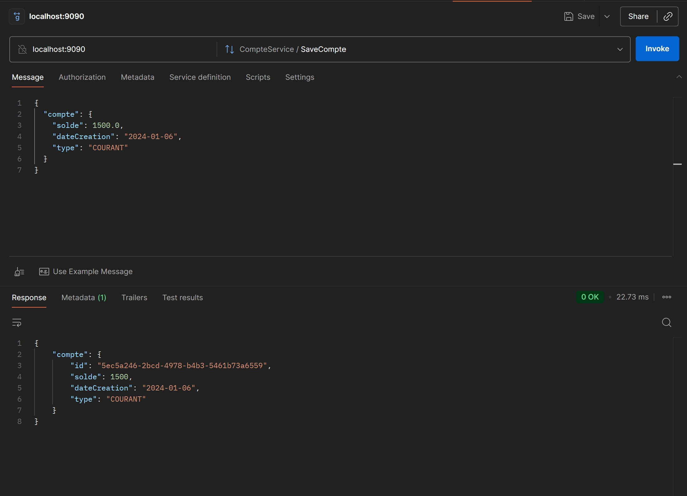
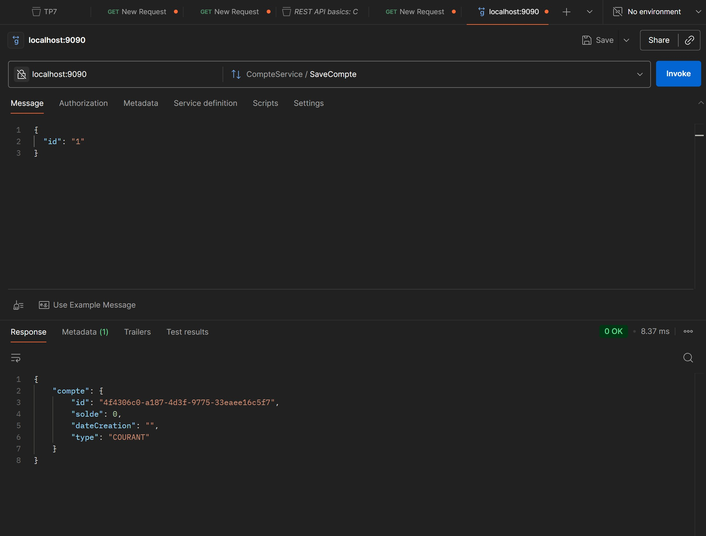
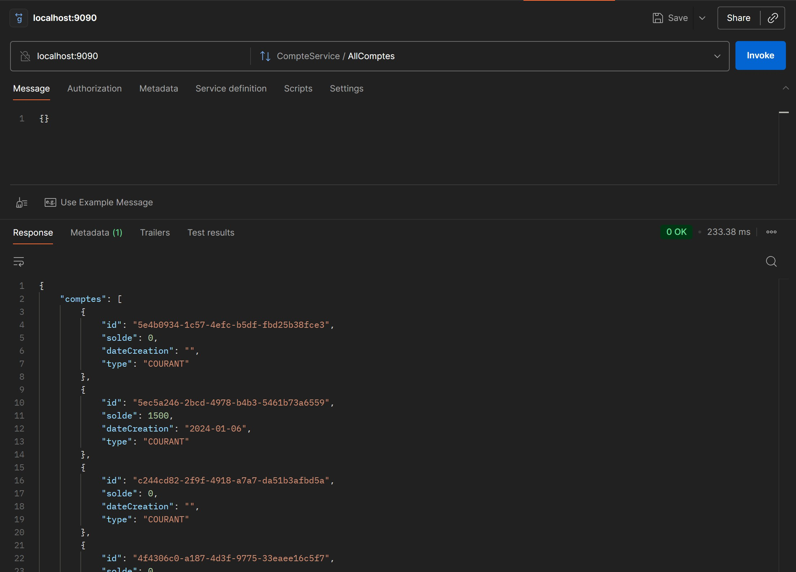

# TP18: Service gRPC Bancaire avec Spring Boot

## Description
Ce projet est une implémentation d'un service gRPC pour la gestion de comptes bancaires. Il utilise Spring Boot, JPA, H2 Database et Protobuf.

## Architecture
- **Service gRPC** : Défini via `CompteService.proto`.
- **Backend** : Spring Boot 3 + gRPC Starter.
- **Data** : H2 In-Memory Database.
- **Test** : BloomRPC ou Postman.

## Comment Lancer
1.  **Compiler** : `mvn clean install`
2.  **Exécuter** : `mvn spring-boot:run`
3.  Le serveur démarre sur le port **9090**.

## Tests avec BloomRPC / Postman

Voici les scénarios de test à réaliser.

### 1. Création d'un Compte (`SaveCompte`)
Permet de créer un nouveau compte bancaire.
- **Méthode** : `SaveCompte`
- **JSON Request** :
```json
{
  "compte": {
    "solde": 7000.0,
    "dateCreation": "2024-05-15",
    "type": "EPARGNE"
  }
}
```
> **Screenshot SaveCompte** :
> 

### 2. Récupérer un Compte par ID (`CompteById`)
Récupère les détails d'un compte spécifique via son ID (copiez l'ID retourné lors de la création).
- **Méthode** : `CompteById`
- **JSON Request** :
```json
{
  "id": "COPIER_ID_ICI"
}
```
> **Screenshot CompteById** :
> 

### 3. Lister tous les Comptes (`AllComptes`)
Affiche la liste de tous les comptes enregistrés.
- **Méthode** : `AllComptes`
- **JSON Request** :
```json
{}
```
> **Screenshot AllComptes** :
> 
